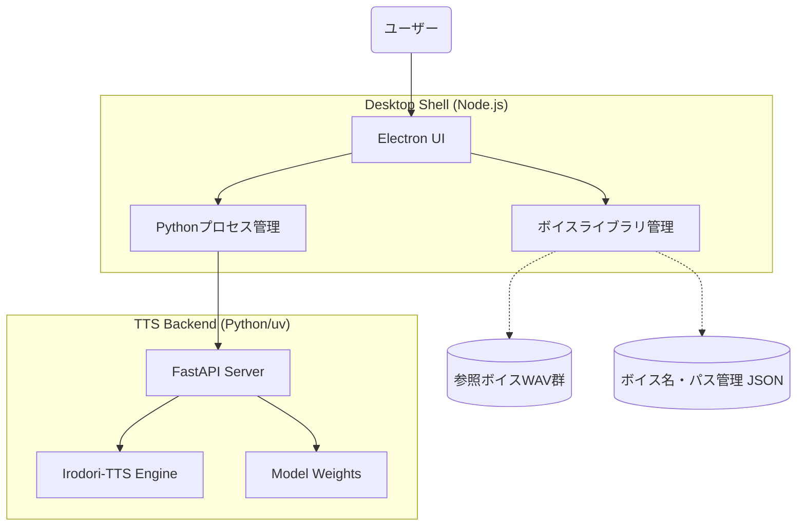

# Irodori-TTS Desktop アプリケーション仕様書

## 1. 概要
本アプリケーションは、**Irodori-TTS**（Flow Matchingベースの音声合成エンジン）をデスクトップPC上で手軽に利用するためのGUIツールです。
参照ボイス（音声サンプル）をライブラリとして管理し、名前を付けて保存・再利用できる機能を備えます。

## 2. システム構成
- **フロントエンド (UI/App Shell)**: Electron + Vanilla JS (または React/Svelte)
- **バックエンド (TTS Engine)**: Python (FastAPI) + `uv`
- **通信方式**: ローカルホスト経由の REST API (HTTP)
- **データ保存**: ローカルファイルシステム (`voices/metadata.json` + `voices/` フォルダ。旧 `references/` レイアウトは初回起動時に自動移行)



## 3. 主要機能

### 3.1 ボイスライブラリ管理
- **インポート**: WAVファイル（参照ボイス）をドラッグ＆ドロップで追加。
- **命名**: インポートしたボイスに名前（例：「落ち着いたお姉さん」「中性的な声」）を付けて保存。
- **削除/編集**: 登録済みボイスの名称変更やライブラリからの削除。
- **サムネイル（任意）**: 音声波形のプレビュー表示。

### 3.2 音声合成 (Synthesis)
- **ボイス選択**: ライブラリから作成したボイスをドロップダウンで選択。
- **テキスト入力**: 合成したい日本語テキストを入力。
- **パラメータ調整** (既存アプリの機能踏襲): 
    - `Num Steps` (生成ステップ数, デフォルト 40)
    - `CFG Guidance Mode` (`independent`, `joint`, `alternating`)
    - `CFG Scale Text` / `CFG Scale Speaker` / `CFG Scale Caption`
    - `Num Candidates` (候補生成数)
    - `Seed` (乱数シード, 空白でランダム)
    - **Advanced Parameters**:
        - `CFG Min t` / `CFG Max t`
        - `Context KV Cache`
        - `Truncation Factor`, `Rescale k`, `Rescale sigma`
        - `Speaker KV Scale`, `Speaker KV Min t`, `Speaker KV Max Layers`
- **即時再生**: 生成された音声をアプリ内で再生。
- **履歴/保存**: 生成した音声のログ保持、およびWAVファイルとしてのエクスポート。

### 3.3 アプリケーション設定
- **デバイス選択**: CPU / CUDA (NVIDIA GPU) / MPS (Apple Silicon) の自動検知と手動切り替え。
- **モデル管理**: 利用するチェックポイント（v1/v2/v3/VoiceDesign）の選択。

### 3.4 データセット作成（Dataset タブ）
- **音声取込**: ファイル選択 / フォルダ選択（5階層まで再帰）/ ドラッグ&ドロップ。
- **自動分割・転記**: Silero-VAD で発話チャンクに分割 → Anime-whisper (`litagin/anime-whisper`) で自動文字起こし。
- **編集**: クリップ単位でテキスト修正・除外フラグ・音声プレビュー。
- **保存**: 名前を付けて `datasets/<name>/`（または任意の外部フォルダ）に保存。LoRA学習の入力として使う。

### 3.5 LoRA 学習（Train タブ）
- **設定**: Dataset / LoRA Name / Base Model（v3 / v2 / Voice Design）/ Preset（`Light`=`diffusion_attn`, `Standard`=`diffusion_attn_mlp`, `Broad`=`all_attn_mlp`）/ Max Steps / Save Every / Batch Size / Gradient Accumulation / Learning Rate。
- **Auto Setting**: データセットのクリップ数・総尺から推奨パラメータを自動算出。
- **実行・監視**: `train.py` をサブプロセス起動し、2秒間隔でstate・step・lossをポーリング表示。停止も可能。
- **完了後**: 生成された PEFT アダプタは自動的に LoRA レジストリへ登録され、Synthesize タブから即利用可能（手動インポート不要）。
- 詳細は [../docs/desktop-app.md](../docs/desktop-app.md) と [../docs/lora-usage.md](../docs/lora-usage.md) を参照。

## 4. API 設計 (Python バックエンド・FastAPI)

FastAPIによる常駐サーバーを構築します。**外部PCからのAPIコールも受け付けるため、ホストは `0.0.0.0`** で動作させます。

### 4.1 `POST /api/v1/synthesize`
合成を実行するメインエンドポイント（FastAPI経由）。
- **Request Body**:
    ```json
    {
      "text": "こんにちは、今日はいい天気ですね。",
      "ref_wav_path": "C:/path/to/reference.wav",
      "num_steps": 40,
      "cfg_scale_text": 3.0,
      "cfg_scale_speaker": 5.0,
      "seed": null
    }
    ```
- **Response**:
    - 生成された音声データのバイナリ (Audio/WAV) または保存先パス。

### 4.2 `GET /api/v1/status`
サーバーおよびモデルのロード状況を確認。レスポンス内に登録済みボイス（`registered_voices`）も含まれます。

### 4.3 `GET /api/v1/voices`
登録されている全てのボイス一覧を JSON 形式で取得できます。

### 4.4 `GET /v1/models` (OpenAI 互換)
OpenAI 互換クライアント（SillyTavern等）からのモデル一覧取得リクエストに対応します。
デフォルトの `tts-1` などに加えて、登録されているボイスが、IDとしてボイス名を持った状態（例: `"id": "my-voice"`）で返されます。

## 5. データ構造

### `voices/metadata.json` (ボイス管理用)
```json
{
  "voices": [
    {
      "id": "voice_001",
      "name": "落ち着いたナレーション",
      "path": "appdata/voices/voice_001.wav",
      "created_at": "2026-04-08T03:00:00Z"
    }
  ]
}
```

## 6. 実装フェーズ
1. **Phase 1 (Backend)**: `uv` を使用し、外部からの通信も可能なFastAPIベースの軽量音声合成サーバー（`0.0.0.0`）を作成。
2. **Phase 2 (Electron Scaffold)**: Electronの基本構成を作成し、バックグラウンドでのPython APIサーバーの自動起動・管理の仕組みを実装。
3. **Phase 3 (Frontend UI)**: ボイスライブラリ管理画面および合成画面の作成。APIサーバーへのリクエスト送信機能を搭載。
4. **Phase 4 (Packaging)**: アプリケーションのパッケージング（配布可能な形式へ）。
